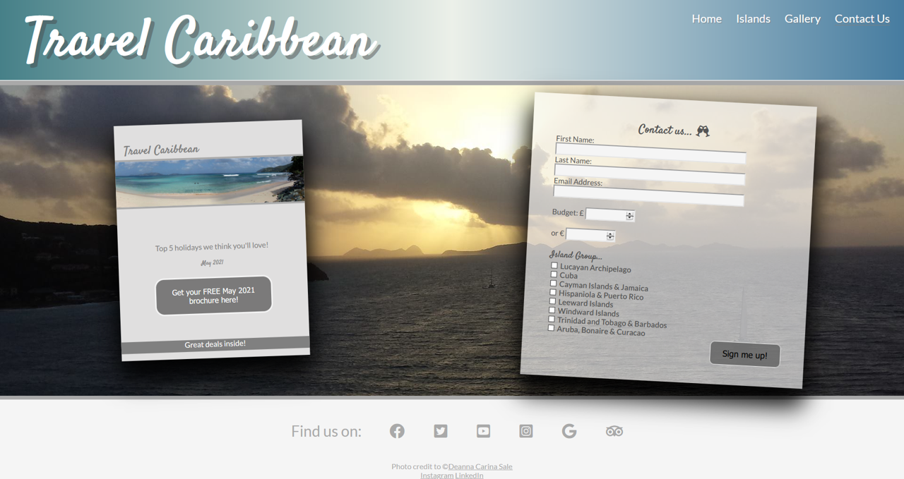

# Travel Caribbean

Milestone One Project: HTML/CSS Essentials - Code Institute - Deadline 1st July 2021

This is my submission for Code Institute's Milestone One Project. It is a fictitious company with coresponding website which provides the service of planning customers' holidays in The Caribbean. The website is created with **ONLY** HTML5 and CSS3. The website covers the most basic function of the company: "The new way to plan your Caribbean getaway", the steps a customer can take to get started on their holiday ideas, reviews from customers, a gallery page and a page to sign up to the company's brochure which is published every month. There are also contact links at the bottom of the page with personal links to my own Instagram acount as all static images have come from my own photography portfolio.

# Contents

<ul>
    <li>
        <a href="#demo"><strong>Demo</strong></a>
    </li>
    <li>
        <a href="#UX"><strong>UX</strong></a>
        <ul>
            <li><a href="#Goals">Goals</a>
                <ul>
                    <li>Vision</li>
                    <li>Aim</li>
                    <li>Target Audience</li>
                </ul>
            </li>
            <li><a href="#User-Stories">User Stories</a>
                <ul>
                    <li>New Customer</li>
                    <li>Returning Customer</li>
                </ul>
            </li>
            <li><a href="#Structure">Structure</a>
                <ul>
                    <li>Design
                        <ul>
                            <li>Typography</li>
                            <li>Color Scheme</li>
                            <li>Design - Images</li>
                            <li>Design - Video</li>
                        </ul>
                    </li>    
                    <li>Five Planes
                        <ul>
                            <li>Strategy</li>
                            <li>Scope</li>
                            <li>Structure</li>
                            <li>Skeleton</li>
                            <li>Surface</li>
                        </ul>
                    </li>
                </ul>
            </li>
        </ul>
    </li>
    <li>
        <a href="#Technologies"><strong>Technologies</strong></a>
    </li>
    <li>
        <a href="#Features"><strong>Features</strong></a>
        <ul>
            <li>
                Features Left to Implement
            </li>
        </ul>
    </li>
    <li>
        <a href="#Testing"><strong>Testing</strong></a>
        <ul>
            <li>Fuctionality</li>
            <li>Compatibility</li>
            <li>User Testing Stories</li>
            <li>Code Validation</li>
            <li>Issues found during development</li>
            <li>Issues found during deployment</li>
            <li>Performance testing (lighthouse)</li>
        </ul>    
    </li>
    <li>
        <a href="#Deployment"><strong>Deployment</strong></a>
    </li>
    <li>
       <a href="#Credits"><strong>Credits</strong></a> 
        <ul>
            <li>Content</li>
            <li>Credits - Images</li>
            <li>Credits - Video</li>
            <li>Acknowledgements</li>
        </ul>
    </li>
    <li>
        <a href="#Screenshots"><strong>Screenshots</strong></a>
    </li>
</ul>

# Demo
A live demo of the website can be found <a href="https://deannacarina.github.io/CI-MP-1/index.html" target="_blank">**HERE**</a>

# UX
<a href="#Contents">Back to the top.</a>

## Goals
### Vision
### Aim
### Target Audience
<a href="#Contents">Back to the top.</a>

## User stories
### New customer
### Returning Customer
<a href="#Contents">Back to the top.</a>

## Structure
### Design
#### Typography
#### Color Scheme
#### Design - Images
#### Design - Video
### Five Planea
#### Strategy
#### Scope
#### Structure
#### Skeleton (wireframes)
#### Surface
<a href="#Contents">Back to the top.</a>

# Technologies
<a href="#Contents">Back to the top.</a>

# Features
## Features left to implement
<a href="#Contents">Back to the top.</a>

# Testing
## Functionality
## Compatibility
## User Testing Stories
## Code Validation
## Issues found during development
## Performance Testing (lighthouse)
<a href="#Contents">Back to the top.</a>
    
# Deployment
<a href="#Contents">Back to the top.</a>

# Credits
## Content
## Credits - Images
## Credits - Video
## Acknowledgements
<a href="#Contents">Back to the top.</a>

# Screenshots
 
 
 
 
 
 
<a href="#Contents">Back to the top.</a>