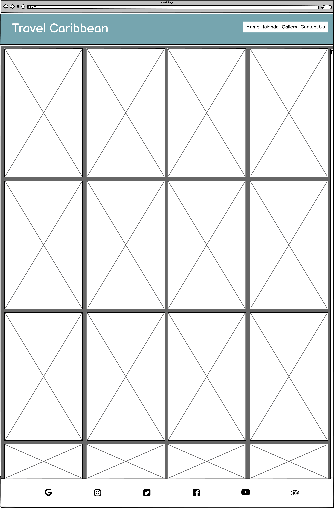
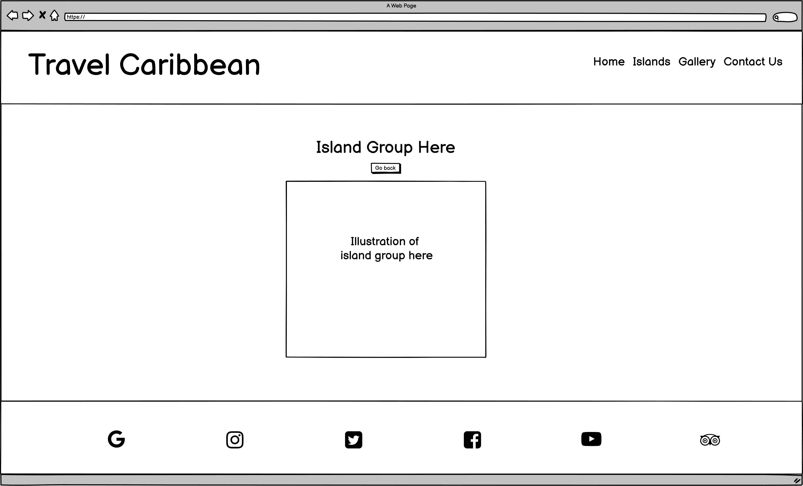
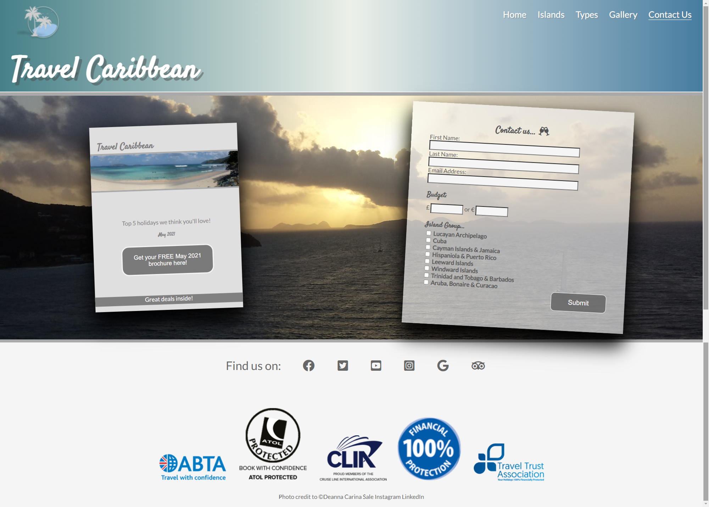
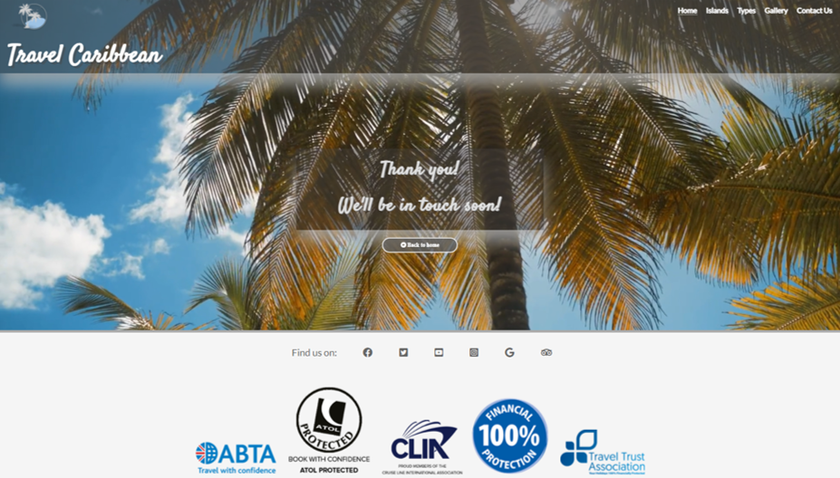
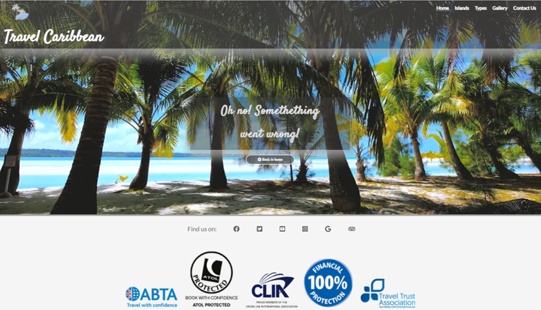
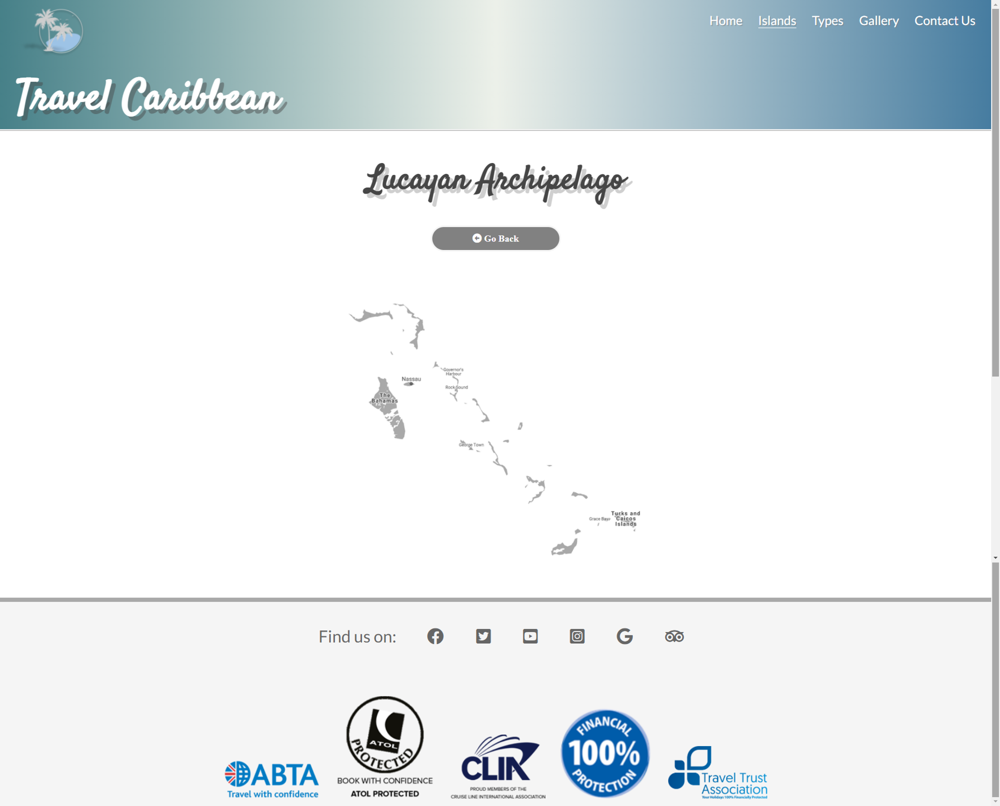

** Things to do before submission **
1. Run code through validators.
2. Clean up code.
3. Finish README.md

# Travel Caribbean

Milestone One Project: HTML/CSS Essentials - Code Institute - Deadline 1st July 2021

This is my submission for Code Institute's Milestone One Project. It is a fictitious company with coresponding website which provides the service of planning customers' holidays in The Caribbean. The website is created with **ONLY** HTML5 and CSS3. The website covers the most basic function of the company: "The new way to plan your Caribbean getaway", the steps a customer can take to get started on their holiday ideas, reviews from customers, a gallery page and a page to sign up to the company's brochure which is published every month, as well as two pages to help the customer make the decision of where they would like to go (Islands) and what type of holiday they would like to partake in (Types). There are also contact links at the bottom of all pages with personal links to my own Instagram acount as many static images have come from my own photography portfolio (from index.html, gallery.html and contact.html, as well as the background images of the brochure downloadable).

# Contents

<ul>
    <li>
        <a href="#demo"><strong>Demo</strong></a>
    </li>
    <li>
        <a href="#UX"><strong>UX</strong></a>
        <ul>
            <li><a href="#Goals">Goals</a>
                <ul>
                    <li>Vision</li>
                    <li>Aim</li>
                    <li>Target Audience</li>
                </ul>
            </li>
            <li><a href="#User-Stories">User Stories</a>
                <ul>
                    <li>New Customer</li>
                    <li>Returning Customer</li>
                </ul>
            </li>
            <li><a href="#Structure">Structure</a>
                <ul>
                    <li>Design
                        <ul>
                            <li>Typography</li>
                            <li>Color Scheme</li>
                            <li>Design - Images</li>
                            <li>Design - Video</li>
                        </ul>
                    </li>    
                    <li>Five Planes
                        <ul>
                            <li>Strategy</li>
                            <li>Scope</li>
                            <li>Structure</li>
                            <li>Skeleton</li>
                                <ul>
                                    <li>index.html - Wireframe</li>
                                    <li>islands.html - Wireframe</li>
                                    <li>types.html - Wireframe</li>
                                    <li>gallery.html - Wireframe</li>
                                    <li>contact.html - Wireframe</li>
                                    <li>thanks.html - Wireframe</li>
                                    <li>Hidden Map Pages - Wireframe</li>
                                    <li>404.html</li>
                                </ul>
                            <li>Surface</li>
                        </ul>
                    </li>
                </ul>
            </li>
        </ul>
    </li>
    <li>
        <a href="#Technologies"><strong>Technologies</strong></a>
    </li>
    <li>
        <a href="#Features"><strong>Features</strong></a>
        <ul>
            <li>
                Features Left to Implement
            </li>
        </ul>
    </li>
    <li>
        <a href="#Testing"><strong>Testing</strong></a>
        <ul>
            <li>Fuctionality</li>
            <li>Compatibility</li>
            <li>User Testing Stories</li>
            <li>Code Validation</li>
            <li>Issues found during development</li>
            <li>Issues found during deployment</li>
            <li>Performance testing (lighthouse)</li>
        </ul>    
    </li>
    <li>
        <a href="#Deployment"><strong>Deployment</strong></a>
    </li>
    <li>
       <a href="#Credits"><strong>Credits</strong></a> 
        <ul>
            <li>Content</li>
            <li>Credits - Images</li>
            <li>Credits - Video</li>
            <li>Acknowledgements</li>
        </ul>
    </li>
    <li>
        <a href="#Screenshots"><strong>Screenshots</strong></a>
        <ul>
            <li>index.html - Screenshot</li>
            <li>islands.html - Screenshot</li>
            <li>types.html - Screenshot</li>
            <li>gallery.html - Screenshot</li>
            <li>contact.html - Screenshot</li>
            <li>thanks.html - Screenshot</li>
            <li>404.html - Screenshot</li>
            <li>Hidden Map Pages - Screenshot</li>
        </ul>
    </li>
    <li>
        <a href="#References"><strong>References</strong></a>
    </li>
</ul>

# Demo
A live demo of the website can be found <a href="https://deannacarina.github.io/CI-MP-1/index.html" target="_blank">**HERE**</a>

<a href="#Contents">Back to the top.</a>

# UX

## Goals
### Vision
Planning a holiday to the Caribbean can be daunting and confusing for many people due to the massive amount of choice that the Caribbean provides [1][2]. As a frequent traveller to the Caribbean, I felt there was a gap in the market to provide potential travellers to the Caribbean with a straightforward and easy means of learning about the 
potential locations to travel to, and the different types of holiday they can go on, as well as the different activites and excursions customers can go on once they are in
the Caribbean to experience the best the Caribbean has to offer. Much like an online travel-agent, I hope the website can provide confidence to customers to take the 
leap and book their holiday to the Caribbean as there are so many amazing things to see and do, as well as incredible cultures to experience. 

### Aim
The business aims for this site are:
<ol>
    <li>To earn commision from partner companies that are advertised via the website</li>
    <li>To earn income from customers by charging a fee to plan and organise their Caribbean Holiday (fee included in overall holiday price)</li>
    <li>To build a database of customers that have used the services of the website for future holidays</li>
    <li>To be easily findable via search engines</li>
    <li>To be shareable between current customers and potential customers for potential future revenue</li>
</ol>
The user aims for this site are:
<ol>
    <li>To help customers decide on where they would like to go on their Caribbean Holiday</li>
    <li>To help customers decide on what type of holiday they would like for their Caribbean getaway</li>
    <li>To help customers decide what they would like to do on their Caribbean Holiday for excursions and activities</li>
    <li>To visually help customers by providing a gallery page of images taken in the Caribbean</li>
    <li>To provide customers with an easy to use and intuitive contact form to be able to request extra information</li>
    <li>To make the site intuative and easily usable to enable customers learn about the Caribbean</li>
    <li>To provide customers with a downloadable brochure to advertise examples of package holidays they can have in the Caribbean</li>
</ol>

### Target Audience
There are a number of target audiences for this website due to the range and number of different locations and holiday types on offer. 
The theory of potential target audiences are as follows:
<ul>
    <li><strong>Age 18-30</strong> - This is the group of potential customers that are most likely to want to experience 'rustic' travel [3] </li>
    <li><strong>Age 30-60</strong> - This is the group of potential customers that are more likly to want family holidays</li>
    <li><strong>Age 60+</strong> - This is the group of potential customers that are likely to want holidays away during their retirement, paticularly cruises. This demographic also has a likelihood of having a large proportion of solo travellers [4]</li>
    <li><strong>Naturists</strong> - as clothing optional holidays are very niche, it is important for this group of individuals to have a place to go to cater to their more specialist wants and needs</li>
    <li><strong>Adventurous People</strong> - This is the group of people more likely to use the services of the website to plan and book excursions in the Caribbean</li>
    <li><strong>Newly engaged couples</strong> - This is the group of people more likely to want to organise group holidays for hen and stag parties</li>
    <li><strong>Newly married couples</strong> - This is the group of people more likely to want to use the services of the website to plan a honeymoon</li>
    <li><strong>British People</strong> - Britains account for nearly 40% of foreign tourist arrivals in Barbados [5], I would like to utilise this and target the website towards British travellers as there is a huge market for Caribbean travel from the United Kingdom and Ireland, especially due to the direct flights from international airports such as Manchester and Heathrow.</li>
</ul>
<a href="#Contents">Back to the top.</a>

## User stories
### New customer
### Returning Customer
<a href="#Contents">Back to the top.</a>

## Structure
### Design
#### Typography
#### Color Scheme
#### Design - Images
#### Design - Video
### Five Planea
#### Strategy
#### Scope
#### Structure
#### Skeleton (wireframes)
##### index.html
 
 

##### islands.html
 
 

##### types.html
 
 

##### gallery.html
 
 

##### contact.html
 
 

##### thanks.html
 
 

##### Hidden Map Pages
 
 

##### 404.html
  

#### Surface
<a href="#Contents">Back to the top.</a>

# Technologies
<a href="#Contents">Back to the top.</a>

# Features
## Features left to implement
<a href="#Contents">Back to the top.</a>

# Testing
## Functionality
## Compatibility
## User Testing Stories
## Code Validation
## Issues found during development
## Performance Testing (lighthouse)
<a href="#Contents">Back to the top.</a>
    
# Deployment
<a href="#Contents">Back to the top.</a>

# Credits
## Content
## Credits - Images
## Credits - Video
## Acknowledgements
<a href="#Contents">Back to the top.</a>

# Screenshots
##### index.html
Home/Landing page 
 
 

##### islands.html
Page for learning about the different island groups 
 
 

##### types.html
Page for learning about the different types of holidays on offer 
 
 

##### gallery.html
Page for viewing images of different holiday types and islands 
 
 

##### contact.html
Page for customer to place their details and say what they're interested in, link to downloadable brochure here 
 
 

##### thanks.html
Page directed to via submit button in form of contact.html 
 
 

##### 404.html
Page for when errors occur with web address 
 
 

##### Hidden Map Pages 
Linked via islands.html to view thumbnail maps at larger size 
 
 
<a href="#Contents">Back to the top.</a>

# References
<ol>
    <li>[1]Lonely Planet, 2021. How to choose a Caribbean island – [online]. Available: https://www.lonelyplanet.com/articles/how-to-choose-caribbean-island [Accessed: 05- June- 2021].</li>
    <li>[2]Caribbean Currency, Thomas Cook, 2021. [Online]. Available: https://www.thomascook.com/holidays/caribbean/travel-money. [Accessed: 05- Jun- 2021].</li>
    <li>[3]"10 Backpacking Myths That Shouldn't Stop You Travelling - Backpacker Advice", Backpacker Advice, 2021. [Online]. Available: https://backpackeradvice.com/blog/backpacking-myths.html. [Accessed: 05- Jun- 2021].</li>
    <li>[4]D. Horscroft and D. Horscroft, "Population estimates by marital status and living arrangements, England and Wales - Office for National Statistics", Ons.gov.uk, 2021. [Online]. Available: https://www.ons.gov.uk/peoplepopulationandcommunity/populationandmigration/populationestimates/bulletins/populationestimatesbymaritalstatusandlivingarrangements/2002to2017. [Accessed: 06- Jun- 2021].</li>
    <li>[5]C. Jönsson and D. Devonish, "Does Nationality, Gender, and Age Affect Travel Motivation? a Case of Visitors to The Caribbean Island of Barbados", Journal of Travel & Tourism Marketing, vol. 25, no. 3-4, pp. 398-408, 2008. Available: 10.1080/10548400802508499 [Accessed 5 June 2021].</li>
</ol>