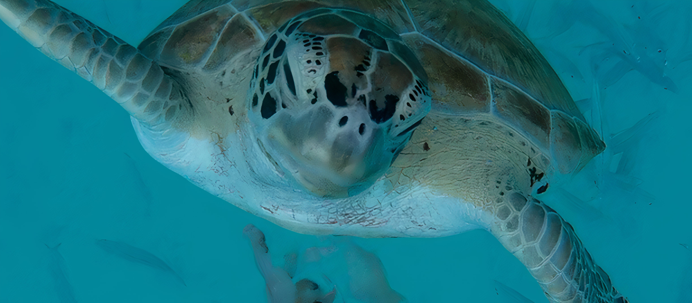
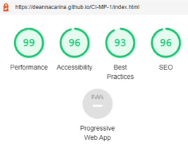

# Travel Caribbean

## Contents
<ul>
    <li>
        <a href="#Introduction"><strong>Introduction</strong></a>
        <ul>
            <li><a href="#Demo">Demo</a></li>
        </ul>
    </li>
    <li>
        <a href="#UX"><strong>UX</strong></a>
        <ul>
            <li>
                <a href="#Strategy">Strategy</a>
            </li>
            <li>
                <a href="#Scope">Scope</a>
            </li>  
            <li>
                <a href="#Structure">Structure</a>
            </li>    
            <li>
                <a href="#Skeleton">Skeleton</a>
            </li>        
            <li>
                <a href="#Surface">Surface</a>
            </li>
        </ul>                
    </li>
    <li>
        <a href="#Technologies"><strong>Technologies</strong></a>
    </li>
    <li>
        <a href="#Features"><strong>Features</strong></a>
    </li>
    <li>
        <a href="#Testing"><strong>Testing</strong></a>   
    </li>
    <li>
        <a href="#Deployment"><strong>Deployment</strong></a>
    </li>
    <li>
       <a href="#Credits"><strong>Credits</strong></a> 
    </li>
    <li>
        <a href="#Screenshots"><strong>Screenshots</strong></a>
    </li>
    <li>
        <a href="#References"><strong>References</strong></a>
    </li>
</ul>

# Introduction
Portfolio Project One: HTML/CSS Essentials - Code Institute - Deadline 1st July 2021

This is my submission for Code Institute's (5P) Portfolio Project One. It is a fictitious company with coresponding website which provides the service of planning customers' holidays in The Caribbean. The website is created with HTML and CSS as well as with the use of many other <a href="#Technologies">technologies</a>. The website covers the most basic function of the company: <em>"The new way to plan your Caribbean getaway"</em>, the steps a customer can take to get started on their holiday ideas, reviews from customers, a gallery page and a page to download the company's brochure which is published every month, as well as two pages to help the customer make the decision of where they would like to go (Islands) and what type of holiday they would like to partake in (Types). There are also contact links at the bottom of all pages with personal links to my own Instagram acount as many static images have come from my own photography portfolio (from index.html, gallery.html and contact.html, as well as the background images of the brochure downloadable).

## Demo
A live demo of the website can be found <a href="https://deannacarina.github.io/travelcaribbean/" target="_blank">**HERE**</a>

<a href="#Contents">Back to the top.</a>

# UX
As more people rely on accessing services online the role of UX design has become increasingly important in our digitized world. The five planes provide a conceptual framework for breaking down the task of designing experiences into component elements so that we can understand the problem as a whole [1]. As this framework is structured, extensively used and consistently reliable, I have chosen to use the Five Planes method to design and implement my own website.
## Strategy
### Vision
<em>Travel Caribbean</em> is a specialist travel website focusing on travel to the Caribbean. Planning a holiday to the Caribbean can be daunting and confusing for many people due to the massive amount of choice that the Caribbean provides [2][3]. As a frequent traveller to the Caribbean, I felt there was a gap in the market to provide potential travellers to the Caribbean with a straightforward and easy means of learning about the 
potential locations to travel to, and the different types of holiday they can go on, as well as the different activites and excursions customers can go on once they are in
the Caribbean to experience the best the Caribbean has to offer. Much like an online travel-agent, I hope the website can provide confidence to customers to take the 
leap and book their holiday to the Caribbean as there are so many amazing things to see and do, as well as incredible cultures to experience. From personal experience however, I have found that many online travel agent websites are confusing to navigate and have an overabundance of information, it is my aim to make my own website easily navigatable and provide customers with a structured and logical delivery of information. By doing this, it will encourage customers to stay on the site and want to use the company's services rather than navigate away from the page due to information overload.

### Aims
<ol>
    <li>To earn commision from partner companies that are advertised via the website</li>
    <li>To earn income from customers by charging a fee to plan and organise their Caribbean Holiday (fee included in overall holiday price)</li>
    <li>To build a database of customers that have used the services of the website for future holidays</li>
    <li>To be easily findable via search engines</li>
    <li>To be shareable between current customers and potential customers for potential future revenue</li>
    <li>To help customers decide on where they would like to go on their Caribbean Holiday</li>
    <li>To help customers decide on what type of holiday they would like for their Caribbean getaway</li>
    <li>To help customers decide what they would like to do on their Caribbean Holiday for excursions and activities</li>
    <li>To visually help customers by providing a gallery page of images taken in the Caribbean</li>
    <li>To provide customers with an easy to use and intuitive contact form to be able to request extra information</li>
    <li>To make the site intuative and easily usable to enable customers learn about the Caribbean</li>
    <li>To provide customers with a downloadable brochure to advertise examples of package holidays they can have in the Caribbean</li>
</ol>

### Target Audience
There are a number of target audiences for this website due to the range and number of different locations and holiday types on offer. 
The theory of potential target audiences are as follows:
<ul>
    <li><strong>Age 18-30</strong> - This is the group of potential customers that are most likely to want to experience 'rustic' travel [4] </li>
    <li><strong>Age 30-60</strong> - This is the group of potential customers that are more likly to want family holidays</li>
    <li><strong>Age 60+</strong> - This is the group of potential customers that are likely to want holidays away during their retirement, paticularly cruises. This demographic also has a likelihood of having a large proportion of solo travellers [5]</li>
    <li><strong>Naturists</strong> - as clothing optional holidays are very niche, it is important for this group of individuals to have a place to go to cater to their more specialist wants and needs</li>
    <li><strong>Adventurous People</strong> - This is the group of people more likely to use the services of the website to plan and book excursions in the Caribbean</li>
    <li><strong>Newly engaged couples</strong> - This is the group of people more likely to want to organise group holidays for hen and stag parties</li>
    <li><strong>Newly married couples</strong> - This is the group of people more likely to want to use the services of the website to plan a honeymoon</li>
    <li><strong>British People</strong> - Britains account for nearly 40% of foreign tourist arrivals in Barbados [6], I would like to utilise this and target the website towards British travellers as there is a huge market for Caribbean travel from the United Kingdom and Ireland, especially due to the direct flights from international airports such as Manchester and Heathrow.</li>
</ul>

### User stories
#### Customer
<strong>As a new <em>AND</em> returning customer I want to...</strong>
<ol>
    <li>Know the purpose of the website as soon as I navigate to the home/landing page</li>
    <li>Navigate the website quickly and effectively</li>
    <li>Find everything in the website that I need to find with ease</li>
    <li>Learn about the different locations that are available to me as a holiday destination in the Caribbean</li>
    <li>Learn about the different holiday types that are available to me</li>
    <li>Have a visual aid to help the decision making process of what I would like to do on my holiday to the Caribbean</li>
    <li>Have a visual aid to help the decision making process of where I would like to go on my holiday to the Caribbean</li>
    <li>Know what other customers have said about the company to ensure the company is genuine and good at what they do</li>
    <li>Have some examples of what the company can offer to me for my holiday in the Caribbean via a brochure</li>
    <li>Have updated deals and offers from the company for potential Caribbean holidays</li>
    <li>Have a quick and easy way to contact the company/for the company to contact me</li>
    <li>Have updated information about locations in the Caribbean that may or may not be suitable for travel at that time</li>
    <li>Have links to social media platforms related to the company to view further customer testomonies</li>
    <li>Have links to social media platforms related to the company to view further images of potential locations and excusrions</li>
    <li>Be assured that the locations and excursions advertised by the website are rated and reviewed by customers not affiliated to the company</li>
    <li>Browse the website and get information from the company without an obligation to book a holiday</li>
    <li>Have easy navigation to external sources to further knowledge of different locations to aid in decision making</li>
</ol>

#### Business Operator
<strong>As the business operator I want to...</strong>
<ol>
    <li>Create and maintain a database of clients and customers that have organised travel to the Caribbean via the website</li>
    <li>Create and maintain a database of clients and customers that have expressed interest in travel to the Caribbean via the website</li>
    <li>Create and maintain a database of external companies that do (and would like to) work in partnership with <em>Travel Caribbean</em></li>
    <li>Ensure the website is easily maintainable by software developers by having intutitive and neat code</li>
    <li>Have any media content displayed in the website accessible at all times via a linked file system</li>
    <li>Ensure all navigation links (internal or external) are always fully functional for ease of use</li>
    <li>Ensure the website is fully accessible to users that may have visual imparement</li>
    <li>Ensure the website is intuitive for all age groups and abilities</li>
    <li>Gain comission from external companies advertised via the website and in partnership with the company</li>
    <li>Gain income from customers via a fee placed within the total price of the booked holiday to the Caribbean</li>
    <li>Create a visually stimulating environment for customers to see what is available to them during a Caribbean holiday and increase the 
    likelihood of booking and future potential revenue</li>
    <li>Stand out from other forms of online travel agent to reduce the chance of customers booking Caribbean holidays via competitors</li>
    <li>To provide customers with links to associated social media sites</li>
</ol>

#### Partnership Company
<strong>As a company in partnership with <em>Travel Caribbean</em> I want to...</strong>
<ol>
    <li>Ensure that <em>Travel Caribbean</em> is a company with good reputation that I can affiliate my own company with</li>
    <li>Ensure that any comission paid to <em>Travel Caribbean</em> will result in a guarenteed flow of customers to my own company for guaranteed future revenue</li>
    <li>Have a fast and easy way to contact <em>Travel Caribbean</em> to discuss partnership terms and comission fees</li>
    <li>To have little competition with other external companies affiliated with <em>Travel Caribbean</em> that offer similar products to my own commpany</li>
    <li>Have any advertising via <em>Travel Caribbean</em> to be positive and promotional</li>
    <li>Have a fast and easy way for customers to be able to navigate to my own company's website via <em>Travel Caribbean</em></li>
</ol>
<a href="#Contents">Back to the top.</a>

## Scope
Due to the pitfalls of developing a website based on the MVP (Minimum Viable Product) model such as lack of user experience and enjoyment due to a lack of content, I have chosen instead to base the development of my product using the MMP (Minimum Marketable Product) as this allows a fully functional application to be used by the customer and can solve user problems with the minimum amount of features while still being completely usable [7] - this however does mean that more time must be spent developing and deploying the application without the guarantee of user satisfaction and possibly result in some 'rough edges' that need to be rectified and de-bugged at a later date. By using this method, any feedback from customers will be based on a fully working web-app and result in fully qualitative data due to the product being in a finished state; rather than feedback based on a web-app that has intentionally been left incomplete resulting in feedback from customers who may believe the site to be inadaquate due to lack of content and intuitiveness.
I have been able to confidently use the MMP model due to my own history of travel to the Caribbean and booking holidays in this area of the world. As a customer myself, I can base the functions needed for the website on my own needs and wants from the past, as well as for the future. By incorporating into the website features that I would want to see on websites that I book my own holidays on, I hope that my wants and needs will translate to the wants and needs of the customers visiting the <em>Travel Caribbean</em> website.
The MMP model will:
<ul>
    <li>Create a clear website with enough content for the customers wants and needs to be fulfilled</li>
    <li>Allow me to work within the scope of my abilitiy while also allowing me to challenge myself in areas that I may need to adapt for the needs of the business and website</li>
    <li>Result in a website with high levels of UX</li>
    <li>Show the consumer the level of knowledge the company has in this area of tourism by having adequate amount of content as well as customer testomonials</li>
    <li>Meet the needs of the business and user</li>
</ul>
While following the MMP model, to meet the user and business goals, my website will include:
<ul>
    <li>A self-designed logo on all pages as assurance to the customer we are a trusted-business with our own identity</li>
    <li>A nav-bar on all pages to be able to navigate to separate pages on the website</li>
    <li>Links to associalted social media on all pages within the footer</li>
    <li>A large amount of visual content as booking holidays is a very visual experience - would you book a holiday without seeing where you're going?</li>
    <li>Information for customers of different locations for their holidays and the different types of holidays they can go on including excursions and experiences</li>
    <li>Customer testimonials from previous clients</li>
    <li>Downloadable brochure from website for customers to see what's on offer</li>
    <li>A large gallery (including videos) to allow customers to visualise their potential holiday destinations</li>
    <li>Contact forms to allow customers to contact the company and book holidays</li>
</ul>
<a href="#Contents">Back to the top.</a>

## Structure
This website consists of multiple pages. By having multiple page we can separate large amounts of information into logical sections to make it easier for the user to find what they are looking for. The navigation bar at the top of all of the pages allows the user to easily navigate to the page of the website they are most interested in. There are also certain pages (islands.html and types.html) that have their own internal navigation sections due to these pages being split into logical sections for different islands and different types; these internal page navigation areas mean that the user can be even more specific about what they would like and find it easily.  
<strong>On index.html</strong>: I chose for the 'hero video' to be at the top, the next section to be text to capture the user and to further explain the function of the website, the next section to explain the steps the customer should take in choosing their holiday - this section is very straightforward and minimal to allow for intuitive browsing, the next section to be holiday types - just the types, no extra information, then the review section and finally a link to the contact form and brochure. This is the layout that I found to be most logical; as the user moves down the page they are slowly given the information they need in order to organise a holiday to the Caribbean with the company - this avoids information overload and increases the chance of the customer staying on the website. Some of the sections in index.html also have links within them to be able to navigate to other pages on the site to allow for intuitive browsing - whenever this is available to the user, the destination of the link always has a back button just in case the user wants to go back to where they were before e.g. the user clicks on the 'Beach' type button on in the index page which will take them to the Beach section of types.html, however they may want to go back to the index page to the area they were at previously - the back button provided will take them there. I wanted these sections on the home page to be the most important to the user as they have key information within them.  
<strong>On islands.html</strong>: I chose to have an iframe at the top from Google Maps, to allow the customer the opportunity to do some exploring of the area themselves should they wish. Under the iframe there is an internal nav area, each link representing a different island or island group. These are mainly organised geographically from the islands at the top of the caribbean moving round in a clockwise fashion ending with the ABC islands. Organising by geographical location made most sense to me, and would make it easier to find particular islands on the iframe map. Within each of the sections I have included a back-to-top button, as the page has a lot of information, I didn't want the user to be constantly scrolling up and down the page to see what other island options there are by viewing the nav-bar.  
<strong>On types.html</strong>: I chose to have the same types section from the home page as the internal nav bar, this provides continuity and familiarity for the user. Underneath the nav bar there are nine sections, each representing a type of holiday the customer could have. These don't have a particular order, however I have tried to arrange them as possible popularity - these can easily be moved around and re-ordered as necessary in the future. Within each of the sections I have included a back-to-top button, as the page has a lot of information, I didn't want the user to be constantly scrolling up and down the page to see what other types of holiday there are by viewing the nav-bar.  
<strong>On gallery.html</strong>: I have included a large number of images, as from personal experience I like to look at images of places before I choose them as a potential holiday destination. Under the images, I have also incuded videos via YouTube iframe, these videos are made and published via external sources and are to further help the customer decide where they would like to go on holiday and what they would like to do.  
<strong>On contact.html</strong>: There are two main sections - one for the downloadable brochure and the other for the contact form. The image of the brochure contains a button to be able to download the brochure pdf file.   
<a href="#Contents">Back to the top.</a>

## Skeleton
The wireframes for the <em>Travel Caribbean</em> website were made with the <a href="https://balsamiq.com/">Balsamiq</a> Desktop Applictaion, they can be found by viewing the image below and following the links below the image. As there is a number of pages within the website all containing a fairly large amount of content, I chose to create the wireframes based on a desktop layout as this is how I intend for the website to be viewed most frequently, however I have also created a wireframe for the contact page in mobile version, as the layout of this page will change a lot from being in desktop version to mobile version.  
 
<ul>
    <li>Click <a href="assets/images-readme/wire-islands.png" target="_blank">HERE</a> for islands.html Wireframe</li>
    <li>Click <a href="assets/images-readme/wire-types.png" target="_blank">HERE</a> for types.html Wireframe</li>
    <li>Click <a href="assets/images-readme/wire-gallery.png" target="_blank">HERE</a> for gallery.html Wireframe</li>
    <li>Click <a href="assets/images-readme/wire-contact.png" target="_blank">HERE</a> for contact.html Wireframe</li>
    <li>Click <a href="assets/images-readme/wire-thanks.png" target="_blank">HERE</a> for thanks.html Wireframe</li>
    <li>Click <a href="assets/images-readme/wire-404.png" target="_blank">HERE</a> for 404.html Wireframe</li>
    <li>Click <a href="assets/images-readme/wire-bigmap.png" target="_blank">HERE</a> for large map page linked via islands.html Wireframe</li>
</ul>
The wireframes were created during the website's initial desgin process, as such there are small changes between the layout of the wireframes and the final layout/design of the finished website. The website as designed via Balsamiq is divided into five main sections (Home, Islands, Types, Gallery and Contact), however there are also eight 'hidden' pages which are navigated to via the Islands page (these are to view the small thumbnail map images in a larger way and all have identical layouts), as well as the page which is navigated to via the submit button (the 'Thanks' page) in the contact form and the 404 error page. The 'Thanks' and 404 pages have almost identical layouts as it didn't make sense to have a completely different layout for these pages due to the low frequency of visits these pages may recieve - these pages are identical to the first section of the index page; I felt this added continuity and design flow to the website, the only differences between them is the video used in the background. Due to the website being heavily visual, I chose to focus mostly on which images I would use as backgrounds in the wireframe process to ensure that the images complimented each other, and the images sizes worked with the design of the web page that it was situated within.
  
<a href="#Contents">Back to the top.</a>

## Surface
### Typography
I used <a href="https://fonts.google.com/" target="_blank">Google Fonts</a> to find the typography that I wanted to use for the website. I wanted to use a completely different font for the main title and the headers to the main text body of the website to distinguish between headers and main body, but also to show the importance of different sections and make it obvious for the user/customer when a new section is starting. I chose to use the font 'Satisfy' (seen below) as the cursive writing and free-flow design of it makes it feel more relaxed and whimsical - which is remeniscent of the Caribbean. I initially used an alternative cursive font however this wasn't as easy to read and could have been difficult to understand for those that do not have english as a first language. 
 
I did however have some minor problems with this font such as certain letters in lower case looking like other letters (see example below where the word 'or' actually looked like the word 'on'), however this only occured once in the website and was rectified by putting the word in uppercase. 
 
The font I used for the main text body of the website was 'Lato' as this font is easy to read which is needed when there is large amounts of information to be read and absorbed by customers, it has a modern feel, and is a popular font for many websites. The back-up font is 'Sans-Serif' just in case the font import link fails.

### Colour Scheme
As I want the website to be very visual, it made most sense to me to choose a colour scheme based on an image that is regularly used throughout the site. When I think of the Caribbean, I think of the blue and turquoise waters of the sea, so wanted to have the colour scheme pulled from an image that has these colours within it. I chose the image that is repeated at the bottom of the main pages of the turtle, as this has the blues that remind me of the Caribbean.  
 
I then used the website <a href="http://colormind.io/" target="_blank">colormind.io</a> as this allows the creation of a colour pallette from an image rather than a single colour choice. The colour pallette below is the pallette generated from the turtle image. 
 
I really love the range of blues and will use these throughout my website as background colours and decoration colours. The majority of the pages on the website will have image backgrounds to aid in the visual appeal of the website, however I still want some continuity of colour throughout. As the majority of backgrounds are images, many of the text overlays will have to have a neutral background to have the text be more readable without clashing with the background image, therefore I have chosen the majority of text boxes to have the neutral colour of grey - ranging from darker greys on backgrounds that have a more toned down overall colour (such as the hero video in index.html and the background of the review text boxes): 

 
To lighter and less transparent grey on backgrounds that are more vibrant and could cause problems with reading text (such as those in islands.html and types.html): 

### Icons
The icons used in the website were taken from <a href="https://fontawesome.com/">Font Awesome</a>, they can be seen throughout the site, are used on all pages for the social media links, and are used as calls to action in the Islands and Types pages to aid in navigation. Font Awesome is also the source of the icon used in the tab of the browser for <em>Travel Caribbean</em>.  
The icon used in the header section of the website on all pages was designed in Microsoft Powerpoint. It is made up of a generic png image of some palm trees and incorporated with a border, shadows and light blue eliptical shape (to signify the sea).

### Design - Images
All stationary images on the Home, Gallery and Contact pages, as well as the background images in the downloadable brochure were taken from my personal photography portfolio, I felt that as I have a personal connection to the majority of the photographs on the website, I would have a better understanding of how the images interact with everything else on the page, I also had the advantage of knowing where each photograph was taken, so the labels on the images in the Gallery are all true and accurate.  
The reviewer portraits are actually images of my family (names are falsified for annonymity), so are images either taken by myself or members of my family.  
The stationary images on the Islands and Types pages are aquired from <a href="https://www.pexels.com/" target="_black">Pexels</a>, as these sectional areas are quite large and need to have backgrounds of good quality no matter the screen size, I felt it was important to have images of high resolution, many of the images in my portfolio were not the correct orientation or of high enough quality, so pexels was a great resource for aquiring images to fit the needs of the website.  
The images in the downloadable brochure of the hotels were taken from the hotel sites themselves:
<ul>
    <li><a href="https://sebastiansbvi.com/" target="_blank">Sebastian's on the Beach</a></li>
    <li><a href="https://www.marriott.co.uk/hotels/travel/curbr-renaissance-curacao-resort-and-casino/" target="_blank">Renaissance Curacao Resort</a></li>
    <li><a href="https://www.fortyounghotel.com/" target="_blank">Fort Young Hotel, Roseau</a></li>
    <li><a href="https://www.oasismarigot.com/" target="_blank">Oasis Marigot, St. Lucia Villas</a></li>
    <li><a href="https://www.tripadvisor.co.uk/Hotel_Review-g147380-d148233-Reviews-Young_Island_Resort-St_Vincent_St_Vincent_and_the_Grenadines.html" target="_blank">Young Island Resort</a></li>
</ul>

### Design - Video
All background videos on the website were also aquired from <a href="https://www.pexels.com/" target="_black">Pexels</a>, I was limited a little in terms of which videos I was able to use due to the limitations on file sizes that can be pushed to and stored on GitHub. It is not best practice to store files of this size on GitHub, however for this particular project (being educational), I chose to use the video compression software <a href="https://www.freeconvert.com/video-compressor" target="_balnk">Free Convert Video Compressor</a> to reduce the file size so all videos had a file size of around 5MB (GitHub limit is 10MB). I wanted to use videos that were of a 'slow-motion' nature to reflect the relaxation and calmness that can come with holidays to the Caribbean. I also wanted to use videos that don't have a lot of variation in colour to ensure continuation of accessibility thoughout the videos duration of text that is overlayed (such as the cover text in the Home page, 404 page and thanks page).  
The videos embedded at the bottom of the gallery page were all taken from Youtube, these are generic videos of different places in the Caribbean to inspire the customer and give them ideas about what they might like from their holiday to the Caribbean.

<a href="#Contents">Back to the top.</a>

# Technologies
Throughout the planning, design, testing and deployment of the website, I have used a number of technologies:

### Languages
<ol>
    <li><a href="https://en.wikipedia.org/wiki/HTML5" target="_balnk">HTML</a>
        <ul><li>The main structure of the website</li></ul>
    </li>
    <li><a href="https://en.wikipedia.org/wiki/CSS" target="_balnk">CSS</a>
        <ul><li>For the design of the site</li></ul>
    </li>
    <li>Limited <a href="https://en.wikipedia.org/wiki/JavaScript" target="_balnk">JavaScript</a>
        <ul><li>For importing the kit from Font Awesome</li></ul>
    </li>
    <li>Limited <a href="https://en.wikipedia.org/wiki/Python_(programming_language)" target="_balnk">Python</a>
        <ul><li>For hosting a local server during for testing</li></ul>
    </li>
    <li><a href="https://www.markdownguide.org/" target="_balnk">Markdown</a>
        <ul><li>For the content and structure of the README.md</li></ul>
    </li>
    <li><a href="https://en.wikipedia.org/wiki/Bash_(Unix_shell)" target="_balnk">Bash</a>
        <ul><li>For the CLI of gitpod.io environment and commands for depoloyment to GitHub</li></ul>
    </li>
</ol>   

### Version Control
<ol>
    <li><a href="https://github.com/" target="_balnk">Git & Github</a>
        <ul><li>For the hosting and version control of the website as well as storage for media content on the website</li></ul>
    </li>
    <li><a href="https://www.gitpod.io/" target="_balnk">Gitpod</a>
        <ul><li>The development environment used for writing the code for the website</li></ul>
    </li>
</ol>

### Applications    
<ol>
   <li><a href="https://balsamiq.com/" target="_balnk">Balsamiq (Desktop)</a>
        <ul><li>For the creation of wireframes</li></ul>
    </li>
    <li><a href="https://visualstudio.microsoft.com/" target="_balnk">Visual Studio (Desktop)</a>
        <ul><li>For testing out ideas without interfering with code for website</li></ul>
    </li>
    <li><a href="https://www.microsoft.com/en-gb/microsoft-365/publisher?ms.officeurl=publisher&rtc=1" target="_balnk">Microsoft Publisher</a>
        <ul><li>For creating the downloadable brochure</li></ul>
    </li>
</ol>
    
### Frameworks, Libraries and Programs
<ol>  
    <li><a href="https://developer.chrome.com/docs/devtools/" target="_balnk">Chrome Developer Tools</a>
        <ul><li>To test the responsiveness of the website at varying screen sizes</li></ul>
    </li>
    <li><a href="http://colormind.io/" target="_balnk">Colormind.io</a>
        <ul><li>To create the colour pallete of the website based of an image</li></ul>
    </li>
    <li><a href="https://fonts.google.com/" target="_balnk">Google Fonts</a>
        <ul><li>Used to import the 'Satisfy' and 'Lato' fonts used throughout the website</li></ul>
    </li>
    <li><a href="https://fontawesome.com/" target="_balnk">Font Awesome</a>
        <ul><li>Used on all pages throughout the website to enhance UX and design, also for the tab icon</li></ul>
    </li>
    <li><a href="https://ezgif.com/" target="_blank">Ezgif</a>
        <ul><li>Used to create the Demo gif in the readme file</li></ul>
    </li>
    <li><a href="https://favicon.io/" target="_balnk">Favicon.io</a>
        <ul><li>Used to create the tab icon from an original PNG file</li></ul>
    </li>
    <li><a href="https://validator.w3.org/" target="_balnk">W3C Markup Validation Service</a>
        <ul><li>To test and search for errors in the HTML code</li></ul>
    </li>
    <li><a href="https://jigsaw.w3.org/css-validator/" target="_balnk">Jigsaw W3C CSS Validation Service</a>
        <ul><li>To test and search for errors in the CSS code</li></ul>
    </li>
    <li><a href="http://ami.responsivedesign.is/" target="_balnk">Am I responsive</a>
        <ul><li>To show the responsiveness of the website on different screen sizes at the same time</li></ul>
    </li>
    <li><a href="https://letsenhance.io/" target="_balnk">LetsEnhance.io</a>
        <ul><li>Used to increase the resolution of background images to ensure the quality is high no matter the screen size</li></ul>
    </li>
    <li><a href="https://wave.webaim.org/" target="_balnk">WAVE Web Accessibility Evaluation Tool</a>
        <ul><li>To ensure compliance with accessibility</li></ul>
    </li>
    <li><a href="https://www.freeconvert.com/video-compressor" target="_balnk">Free Convert Video Compressor</a>
        <ul><li>To reduce the file size of the background videos used on the website</li></ul>
    </li>
</ol>   
<a href="#Contents">Back to the top.</a>

# Features
## Features left to implement
<a href="#Contents">Back to the top.</a>

# Testing
To make the testing of my website easier and more structured, I have decided to carry out a 'seven-phase' approach: <a href="#Functionality">Functionality</a>, <a href="#Compatibility">Compatibility</a>, <a href="#user-testing-stories">User Testing Stories</a>, <a href="#validation">Code Validation</a> , <a href="#peer-review">Peer Review</a>, <a href="dev-probs">Development Problems</a> and <a href="perf-test">Performance Testing</a>

## Functionality
The first phase of my testing regime for the website was to look at the functionality of the website and make sure that it meets the needs of the customer on the most basic levels and also to ensure that all the interactive aspects of the website all worked with no problems.  

<ul>
    <li>The form in contact.html:
        <ul>
            <li>Before the form can be subitted, those inputs with required attributes must be completed (First Name, Last Name and Email Address). </li>
            <li>The Budget and Island group sections are optional as the customer may not know this information yet or may want to discuss these aspects with the company first. </li>
            <li>Once required attributed are completed, the submit button will then allow interaction. </li>
            <li>On selection of the submit button, the form will then direct the customer (via 'action' attribute with a link to thanks.html). </li>
        </ul>    
    </li> 
    <li>All internal links on the website need to be usable, and open in the same window.
        <ul>
            <li>All links in the menu bar at the top of all pages will direct the customer to the relevant page: 'Home' - to index.html, 'Islands' - to islands.html, 'Types' - to types.html, 'Gallery' - to gallery.html and 'Contact Us' - to contact.html</li>
            <li>The button in the 'steps' section of index.html will direct the customer to the contact form</li>
            <li>The 'step' numbers in index.html will direct the customer to the relevant page - step 2 will direct to islands.html, step 3 will direct to types.html and step 4 will direct to contact.html. Step 1 does not direct anywhere as there wasn't much to say for 'budget', however it made sense in terms of styling continuity for this div to have the same psuedo class stylings as the other step divs.</li>
            <li>All small thumbnail maps on the islands.html page need to open the page with the larger version of the map. </li>
            <li>All 'back to top' buttons in islands.html need to direct the customer to the top of islands.html to allowe the customer to select a new island group without having to scroll back to the top of the page. </li>
            <li>All divs in the 'nav bar' below the interactive map iframe in islands.html need to direct the customer to the related section within the page. </li>
            <li>All 'go back' buttons on the large island map pages that are navigated to via the thumbnail images need to direct the customer back to the related island section in the islands.html page. </li>
            <li>All divs in the 'nav bar' in the 'types of holiday section' in the index.html and types.html pages need to direct the customer to the relevant types section within the types.html page.</li>
            <li>All 'back to home' buttons in the types sections will direct the customer back to the types of holiday section in index.html. </li>
            <li>All 'back to the top' buttons in the types sections will direct the customer to the top of the types.html page to allow the customer easy navigation to different types without having to scroll to the top of the page. </li>
            <li>The button in the bottom section of index.html, islands.html and types.html with the turtle background image will direct the customer to contact.html to be able to submit the form and download the brochure. </li>
        </ul>    
    </li>       
    <li>All external links on the website need to be usable, and open in a new window.
        <ul>
            <li>The social media links in the footer of all pages will direct the customer to the relevant social media platform.</li>
            <li>The 'reference' links in the islands.html sections will direct the customer to the related Wikipedia pages.</li>
            <li>The partnership logos in the types.html sections will direct the customer to the related website for that external company.</li>
            <li>The downloadable brochure in contact.html will direct the customer to the pdf file stored in GitHub.</li>
        </ul>    
    </li>  
    <li>All elements with an associated psuedo class work when the action is carried out (e.g. Hover).
        <ul>
            <li>All internal link buttons will change colour and gain a shadow styling when the customer hovers over them</li>
        </ul>    
    </li>     
</ul> 

I tested the usability and intuitiveness of the website using different focus groups divided by age:  
<table>
    <tr>
        <th>Age Group</th>
        <th>Quantity</th>
        <th>Comments</th>
    </tr>
    <tr>
        <td><strong>16-25</strong></td>
        <td>2</td>
        <td>
            <ul>
                <li>All participants knew the function of the website at first glance</li>
                <li>All participants found the website easy to navigate</li>
                <li>All participants found the website to be highly visual and appealing in terms of design</li>
                <li>Both Participants viewed the website on their phones</li>
            </ul>
        </td>
    </tr>
    <tr>
        <td><strong>26-35</strong></td>
        <td>6</td>
        <td>
            <ul>
                <li>All participants knew the function of the website at first glance</li>
                <li>5/6 participants found the website easy to navigate, the 6th participant needed prompting on where to go from Home page</li>
                <li>All participants found the website to be highly visual and appealing in terms of design</li>
                <li>3 Participants viewed the website on their phones</li>
                <li>1 Participant viewed the website on their iPad</li>
                <li>1 Participant viewed the website on their Android tablet</li>
                <li>1 Participant viewed the website on their Desktop PC</li>
            </ul>
        </td>
    </tr>
    <tr>
        <td><strong>36-45</strong></td>
        <td>5</td>
        <td>
            <ul>
                <li>All participants knew the function of the website at first glance</li>
                <li>All participants found the website easy to navigate</li>
                <li>All participants found the website to be highly visual and appealing in terms of design</li>
                <li>3 Participants viewed the website on their phones</li>
                <li>2 Participant viewed the website on their Android tablet</li>
            </ul>
        </td>
    </tr>
    <tr>
        <td><strong>46-55</strong></td>
        <td>6</td>
        <td>
            <ul>
                <li>All participants knew the function of the website at first glance</li>
                <li>5/6 participants found the website easy to navigate, the 6th participant needed prompting on where to find the contact page</li>
                <li>All participants found the website to be highly visual and appealing in terms of design</li>
                <li>3 Participants viewed the website on their phones</li>
                <li>3 Participants viewed the website on their iPads</li>
            </ul>
        </td>
    </tr>
    <tr>
        <td><strong>56-65</strong></td>
        <td>4</td>
        <td>
            <ul>
                <li>All participants knew the function of the website at first glance</li>
                <li>All participants found the website easy to navigate, however all needed some minimal prompting throughout via leading statements such as "You can learn about different islands" and "There's a downloadable brochure"</li>
                <li>All participants found the website to be highly visual and appealing in terms of design</li>
                <li>All Participants viewed the website on their phones</li>
            </ul>
        </td>
    </tr>
    <tr>
        <td><strong>66+</strong></td>
        <td>2</td>
        <td>
            <ul>
                <li>All participants knew the function of the website at first glance</li>
                <li>All participants found the website to be easy once there was an 'introduction' of sorts by the developer explaining the functions of the site</li>
                <li>All participants found the website to be highly visual and appealing in terms of design</li>
                <li>Both Participants viewed the website on their Laptops</li>
            </ul>
        </td>
    </tr>
</table>

## Compatibility
The second phase of my testing regime for the website was to ensure that the website is compatible through a range of devices, screen sizes and internet browsers. Throughout the development process, the website was tested on a number of devices: A 17.3 inch windows laptop, a 15.3 inch windows laptop, a 16 inch MacBook Pro, an 8 inch Samsung Galaxy Tab A, a 10.2 inch iPad, A Samsung Galaxy S20 Ultra and A Huawei P30 Pro. It was also tested in Chrome, Firefox, Internet Explorer and Safari as well as Samsung's own internet browser. By also using Chrome Dev Tools, I was able to manually change the screen size to see when elements within the web pages 'break', by using this method, I could pinpoint the exact screen widths and heights to be defined in the CSS media screen queries and alter the stylings to fit accordingly. As I chose not to have a query for phone sizes, another for tablets and another for PCs and instead chose to base the queries on when things start to look 'broken' this did mean a lot of media queries in the stylesheet, however I found it was the best way to ensure responsiveness and to make sure that all elements within the web page were correctly layed out in relation to other elements. The video below shows how I checked the responsiveness of the website at all screensizes.  

<h2 id="user-testing-stories">User Testing Stories</h1>
The third phase of my testing regime was to ensure that all user stories identified in the <a href="#Strategy">Strategy</a> plane have been acknowledged and achieved.
<em>"I want to know the purpose of the website as soon as I navigate to the home/landing page" & "I want to navigate the website quickly and effectively" & "I want to find everything in the website that I need to find with ease"</em> 
 
>Text here about how we have achieved this goal  

<em>"I want to learn about the different locations that are available to me as a holiday destination in the Caribbean" & "I want to learn about the different holiday types that are available to me" & "I want to have updated information about locations in the Caribbean that may or may not be suitable for travel at that time" & "I want to have a visual aid to help the decision making process of what I would like to do on my holiday to the Caribbean" & "I want to have a visual aid to help the decision making process of where I would like to go on my holiday to the Caribbean"</em> 
 
 
>Text here about how we have achieved this goal  

<em>"I want to know what other customers have said about the company to ensure the company is genuine and good at what they do"</em> 
 
>Text here about how we have achieved this goal  

<em>"I want to have some examples of what the company can offer to me for my holiday in the Caribbean via a brochure" & "I want to have updated deals and offers from the company for potential Caribbean holidays"</em> 
 
>Text here about how we have achieved this goal  

<em>"I want to have a quick and easy way to contact the company/for the company to contact me"</em> 
 
>Text here about how we have achieved this goal  

<em>"I want to have easy navigation to external sources to further knowledge of different locations to aid in decision making" & "I want to have links to social media platforms related to the company to view further customer testomonies" & "I want to have links to social media platforms related to the company to view further images of potential locations and excusrions"</em> 
 
>Text here about how we have achieved this goal  

<em>"I want to be assured that the locations and excursions advertised by the website are rated and reviewed by customers not affiliated to the company"</em> 
>Text here about how we have achieved this goal  

<em>"I want to browse the website and get information from the company without an obligation to book a holiday"</em> 
>Text here about how we have achieved this goal  

<h2 id="validation">Code Validation</h2>
The fourth phase of my testing regime for the website was to ensure all code written passes through code validation software with no errors or warnings.

#### HTML Code Validation
Below is a run-through off the code validation process of all pages on the website, all of the pages did come back with errors - some very small, some larger! However all errors and warnings were rectified and all pages now pass through validation with no errors or warnings.

##### index.html
The below code validation report is from index.html. There were minimal errors found on this page. The main 'errors' were repeated id attributes, this was rectified by replacing the id attributes with class attributes instead.
  

##### islands.html
The below code validation report is from islands.html. There were a few validation errors on this page concerning the iframe found at the top of the page containing the interactive caribbean map. One of these was the text within the iframe opening and closing tags - the validator classed this as an error; I found this to be a problem with w3schools rather than the validation service itself by finding a GitHub thread concerning this matter <a href="https://github.com/validator/validator/issues/592" target="_blank"><strong>HERE</strong></a>. There were also problems with using percentages as height/width and using px as a height/width definition. As I wanted to ensure responsiveness of the iframe, to work around this error, I gave the iframe an id attribute and styled the element within the CSS instead. Once the iframe errors has been rectified, a clean validation report was returned. 
  

##### types.html
The below code validation report is from types.html. There were minimal errors for this page, the only reported errors were that one or two sections did not contain a heading. To fix this problem, I added heading elements to the sections, but styled the text as transparent and nil display. 
  

##### gallery.html
The below code validation report is from gallery.html. There were a few validation errors on this page concerning the iframes found in the video section of the page. One of these was the text within the iframe opening and closing tags - the validator classed this as an error; I found this to be a problem with w3schools rather than the validation service itself by finding a GitHub thread concerning this matter <a href="https://github.com/validator/validator/issues/592" target="_blank"><strong>HERE</strong></a>. There were also problems with using percentages as height/width and using px as a height/width definition. As I wanted to ensure responsiveness of the iframe, to work around this error, I gave the iframe an id attribute and styled the element within the CSS instead. Most of the errors concerning the iframes in the gallery page were brought about by the pre-built code from Youtube's embedding option. Once the iframe errors has been rectified, a clean validation report was returned. The error report from before code cleanup can be found <a href="assets/images-readme/errors-gallery.pdf" target="_blank"><strong>HERE</strong></a>. 
  

##### contact.html
The below code validation report is from contact.html - the page website visitors are directed to when the form on contact.html is submitted. It needed a slight alteration to change the back 'button' from a button element to a div element as the code validator showed an error when the button was wrapped in an anchor element. 
  

##### 404.html
The below code validation report is from 404.html - the page website visitors are directed to when an invalid web address is used. It needed a slight alteration to change the back 'button' from a button element to a div element as the code validator showed an error when the button was wrapped in an anchor element. 
  

##### Large map page linked via islands.html Wireframe
The below code validation report is from one of the pages used to magnify the map thumbnails from islands.html. All of the validation reports were identical for these pages as they are almost identical (the only difference is the map image and the heading text). All of these needed a slight alteration to change the back 'button' from a button element to a div element as the code validator showed an error when the button was wrapped in an anchor element. 
  

#### CSS Code Validation
The main edits that I needed to make to the CSS file during code validation were as a result of changing ID's to Classes in the html files and having stylings for the iframes in the CSS rather than in-element stylings. The only 'errors' that came back were for some stylings (around 3 or 4) that I had accidentally given a value of '0', these were removed and the code re-run through the validator, it then passed with no errors or warnings. 

<h2 id="peer-review">Peer Review</h2>
<h2 id="dev-probs">Issues found during development</h2>
<h2 id="perf-test">Performance Testing</h2>
  

<a href="#Contents">Back to the top.</a>
    
# Deployment
<a href="#Contents">Back to the top.</a>

# Credits
## Content
<ul>
    <li>Factual statements used in the islands.html file are taken from the Wikipedia pages of the relevant websites (referenced via external link in the relevant information box)</li>
    <li>Factual statements used in the types.html file are found from standard Google searches e.g. "<em>What is the average temerature in the Caribbean?</em>", "<em>When is hurricane season in the Carribean</em>" and "<em>What were the after effects of Hurricane Irma?"</em></li>
    <li>The bulk of the text foud in the types.html page are written from my own thoughts and ideas</li>
    <li>The reviews written in index.html were written by my family members and myself</li>
    <li>HTML code used in the website was taken from the classes delivered by Code Institute in the HTML essentials module</li>
    <li>CSS code used in the website was taken from the classes delivered by Code Institute in the CSS essentials module</li>
</ul>

## Credits - Images
All images seen on the website apart from those listed below are from my own photography portfolio, some of these images can be found on my <a href="https://www.instagram.com/deannacarina/" target="_blank">Instagram</a> page and some on my <a href="https://www.facebook.com/DeannaCarina/photos_albums" target="_blank">Facebook</a> page in the Caribbean Cruise Albums.

### Pexels Images
<ul>
    <li><a href="https://www.pexels.com/photo/sea-flight-flying-ocean-5769702/" target="_blank">Julia Volk</a> - Background image of 'Flights' section in types.html</li>
    <li><a href="https://www.pexels.com/photo/outdoor-loungers-on-seashore-2344530/" target="_blank">Artem Beliaikin</a> - Background image of 'Beach' section in types.html</li>
    <li><a href="https://www.pexels.com/photo/silhouette-photography-of-group-of-people-jumping-during-golden-time-1000445/" target="_blank">Belle Co</a> - Background image of 'Groups' section in types.html</li>
    <li><a href="https://www.pexels.com/photo/boy-standing-beside-seashore-waves-909492/" target="_blank">Hitesh Choudhary</a> - Background image of 'Naturist' section in types.html</li>
    <li><a href="https://www.pexels.com/photo/man-sitting-on-white-sand-seashore-377717/" target="_blank">Porapak Apichodilok</a> - Background image of 'Singles' section in types.html</li>
    <li><a href="https://www.pexels.com/photo/infinity-pool-near-beach-3155666/" target="_blank">Asad Photography</a> - Background image of 'Hotel' section in types.html</li>
    <li><a href="https://www.pexels.com/photo/photo-of-a-person-snorkeling-2404370/" target="_blank">Miles Hardacre</a> - Background image of 'Activity' section in types.html</li>
    <li><a href="https://www.pexels.com/photo/sea-sunset-beach-couple-2145/" target="_blank">Pixabay</a> - Background image of 'Activity' section in types.html</li>
</ul>

### Unsplash Images
<ul>
    <li><a href="https://unsplash.com/photos/Y2V0ph_3_qY" target="_blank">Ray Harrington</a> - Background image of 'Cruises' section in types.html</li>
    <li><a href="https://unsplash.com/photos/Me7ySkVmWcw" target="_blank">Cdric Frixon</a> - Background image of 'Lucayan Archipelago' and 'Leeward Islands' sections of islands.html</li>
    <li><a href="https://unsplash.com/photos/QLL9CGveAO0" target="_blank">Simon Hajducki</a> - Background image of 'Cayman Islands & Jamaica' and 'Trinidad & Tobago and Barbados' sections of islands.html</li>
    <li><a href="https://unsplash.com/photos/fnAN6OFXR9A" target="_blank">Emily Bauman</a> - Background image of 'Cuba', 'Hispaniola and Puerto Rico', 'Windward Islands' and 'ABC islands' sections of islands.html</li>
</ul>

## Credits - Video
### Pexels Videos
<ul>
    <li><a href="https://www.pexels.com/video/low-angle-footage-of-a-palm-tree-6018713/" target="_blank">Nikunj Patel</a> - Background video of thanks.html</li>
    <li><a href="https://www.pexels.com/video/palm-trees-in-the-beach-5270587/" target="_blank">Bela Rice</a> - Background video of 404.html</li>
    <li><a href="https://www.pexels.com/video/close-up-view-of-a-person-walking-along-the-beach-while-holding-a-hat-5937263/" target="_blank">Taryn Elliott</a> - Background video of index.html top section</li>
</ul>

## Acknowledgements
<ul>
    <li>To my fianc - you are my absolute rock and got me through some pretty stressful times! Thankfully as a senior DevOps engineer you were able to stop the mental breakdowns I had when I thought I had to delete my whole project because of a corrupt file... you taught me 'Git Reset'. I love you.</li>
    <li>To my family - thank you for testing the website and giving me lots of tips for making the website have a better user experience, your advice and ideas mean the world and I could never do without you.</li>
    <li>To Nishant Kumar - My mentor. You had to keep me grounded and convince me speeding off at the speed of light isn't always the best thing. I'm still not very good at it... but I am trying to stay grounded and think about things before rushing off to start typing code - perhaps Project Two can be the test?</li>
    <li>To my close work colleages at East Lancs Hospitals Trust - you have supported me through this endevour and also tested out the website, thank you for always wanting the best for me.</li>
    <li>To Katie Raby - You will probably never see this, but you are the reason I'm doing this course. It was your blog post and your journey that has inspired me to become a coder, I'll see you next year at my wedding as you're one of my best friends other halves - but I doubt you'll know how much you've changed my outlook on life. The words 'thank you' will never be enough.</li>
</ul>
<a href="#Contents">Back to the top.</a>

# Screenshots

 
<ul>
    <li>Click <a href="assets/images-readme/screen-types.png" target="_blank">HERE</a> for types.html Screenshot</li>
    <li>Click <a href="assets/images-readme/screen-gallery.png" target="_blank">HERE</a> for gallery.html Screenshot</li>
    <li>Click <a href="assets/images-readme/screen-contact.png" target="_blank">HERE</a> for contact.html Screenshot</li>
    <li>Click <a href="assets/images-readme/screen-thanks.png" target="_blank">HERE</a> for thanks.html Screenshot</li>
    <li>Click <a href="assets/images-readme/screen-404.png" target="_blank">HERE</a> for 404.html Screenshot</li>
    <li>Click <a href="assets/images-readme/screen-map.png" target="_blank">HERE</a> for large map page linked via islands.html Screenshot</li>
</ul>
 
<a href="#Contents">Back to the top.</a>

# References
<ol>
    <li>[1]U. Qureshi, "UX Design using the Five Planes Method", Medium, 2021. [Online]. Available: https://medium.com/designcentered/ux-design-5-planes-method-b1b1d6587c05. [Accessed: 06- Jun- 2021].</li>
    <li>[2]Lonely Planet, 2021. How to choose a Caribbean island  [online]. Available: https://www.lonelyplanet.com/articles/how-to-choose-caribbean-island [Accessed: 05- June- 2021].</li>
    <li>[3]Caribbean Currency, Thomas Cook, 2021. [Online]. Available: https://www.thomascook.com/holidays/caribbean/travel-money. [Accessed: 05- Jun- 2021].</li>
    <li>[4]"10 Backpacking Myths That Shouldn't Stop You Travelling - Backpacker Advice", Backpacker Advice, 2021. [Online]. Available: https://backpackeradvice.com/blog/backpacking-myths.html. [Accessed: 05- Jun- 2021].</li>
    <li>[5]D. Horscroft and D. Horscroft, "Population estimates by marital status and living arrangements, England and Wales - Office for National Statistics", Ons.gov.uk, 2021. [Online]. Available: https://www.ons.gov.uk/peoplepopulationandcommunity/populationandmigration/populationestimates/bulletins/populationestimatesbymaritalstatusandlivingarrangements/2002to2017. [Accessed: 06- Jun- 2021].</li>
    <li>[6]C. Jnsson and D. Devonish, "Does Nationality, Gender, and Age Affect Travel Motivation? a Case of Visitors to The Caribbean Island of Barbados", Journal of Travel & Tourism Marketing, vol. 25, no. 3-4, pp. 398-408, 2008. Available: 10.1080/10548400802508499 [Accessed 5 June 2021].</li>
    <li>[7]Django Stars Blog. 2021. Your Guide to MVP, MMP, MLP, MDP and MAP Startup Stages. [online] Available at: https://djangostars.com/blog/guide-mvp-mmp-mlp-mdp-map-startup-stages [Accessed 7 June 2021].</li>
</ol>