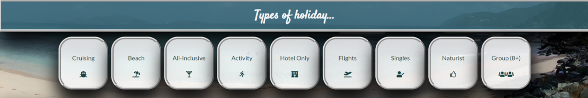
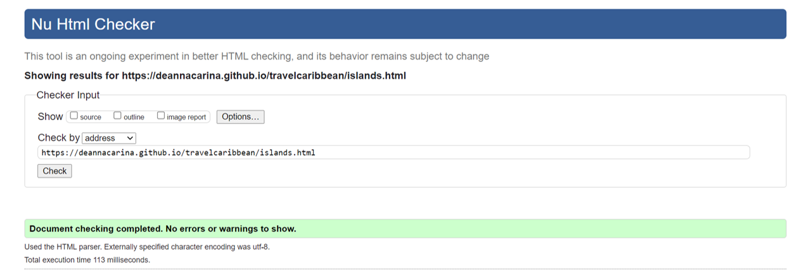
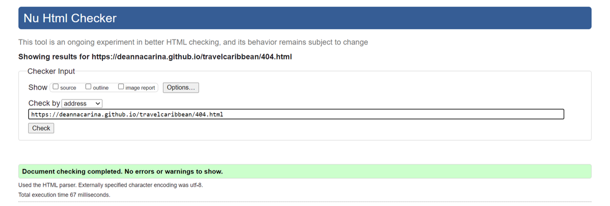

# Testing - Travel Caribbean

<a href="https://github.com/DeannaCarina/travelcaribbean/blob/master/README.md">Back to README.md</a>

## Contents
<ul>
    <li>
        <a href="#Introduction">Introduction</a>
    </li>
    <li>
        <a href="#Functionality">Functionality</a>
    </li>
    <li>
        <a href="#Compatibility">Compatibility</a>
    </li>  
    <li>
        <a href="#user-testing-stories">User Testing Stories</a>
    </li>    
    <li>
        <a href="#validation">Code Validation</a>
    </li>        
    <li>
        <a href="#peer-review">Peer Review</a>
    </li>
    <li>
        <a href="#dev-probs">Development Problems</a>
    </li>
    <li>
        <a href="#Accessibility">Accessibility</a>
    </li>
    <li>
        <a href="#perf-test">Performance Testing</a>
    </li>
</ul>

## Introduction
To make the testing of my website easier and more structured, I have decided to carry out an 'eight-phase' approach: <a href="#Functionality">Functionality</a>, <a href="#Compatibility">Compatibility</a>, <a href="#user-testing-stories">User Testing Stories</a>, <a href="#validation">Code Validation</a>, <a href="#peer-review">Peer Review</a>, <a href="dev-probs">Development Problems</a>, <a href="#Accessibility">Accessibility</a> and <a href="perf-test">Performance Testing</a>  
<a href="#Contents">Back to the top.</a>

## Functionality
The first phase of my testing regime for the website was to look at the functionality of the website and make sure that it meets the needs of the customer on the most basic levels and also to ensure that all the interactive aspects of the website all worked with no problems.  

<ul>
    <li>The form in contact.html:
        <ul>
            <li>Before the form can be subitted, those inputs with required attributes must be completed (First Name, Last Name and Email Address). </li>
            <li>The Budget and Island group sections are optional as the customer may not know this information yet or may want to discuss these aspects with the company first. </li>
            <li>Once required attributed are completed, the submit button will then allow interaction. </li>
            <li>On selection of the submit button, the form will then direct the customer (via 'action' attribute with a link to thanks.html). </li>
        </ul>    
    </li> 
    <li>All internal links on the website need to be usable, and open in the same window.
        <ul>
            <li>All links in the menu bar at the top of all pages will direct the customer to the relevant page: 'Home' - to index.html, 'Islands' - to islands.html, 'Types' - to types.html, 'Gallery' - to gallery.html and 'Contact Us' - to contact.html</li>
            <li>The button in the 'steps' section of index.html will direct the customer to the contact form</li>
            <li>The 'step' numbers in index.html will direct the customer to the relevant page - step 2 will direct to islands.html, step 3 will direct to types.html and step 4 will direct to contact.html. Step 1 does not direct anywhere as there wasn't much to say for 'budget', however it made sense in terms of styling continuity for this div to have the same psuedo class stylings as the other step divs.</li>
            <li>All small thumbnail maps on the islands.html page need to open the page with the larger version of the map. </li>
            <li>All 'back to top' buttons in islands.html need to direct the customer to the top of islands.html to allowe the customer to select a new island group without having to scroll back to the top of the page. </li>
            <li>All divs in the 'nav bar' below the interactive map iframe in islands.html need to direct the customer to the related section within the page. </li>
            <li>All 'go back' buttons on the large island map pages that are navigated to via the thumbnail images need to direct the customer back to the related island section in the islands.html page. </li>
            <li>All divs in the 'nav bar' in the 'types of holiday section' in the index.html and types.html pages need to direct the customer to the relevant types section within the types.html page.</li>
            <li>All 'back to home' buttons in the types sections will direct the customer back to the types of holiday section in index.html. </li>
            <li>All 'back to the top' buttons in the types sections will direct the customer to the top of the types.html page to allow the customer easy navigation to different types without having to scroll to the top of the page. </li>
            <li>The button in the bottom section of index.html, islands.html and types.html with the turtle background image will direct the customer to contact.html to be able to submit the form and download the brochure. </li>
        </ul>    
    </li>       
    <li>All external links on the website need to be usable, and open in a new window.
        <ul>
            <li>The social media links in the footer of all pages will direct the customer to the relevant social media platform.</li>
            <li>The 'reference' links in the islands.html sections will direct the customer to the related Wikipedia pages.</li>
            <li>The partnership logos in the types.html sections will direct the customer to the related website for that external company.</li>
            <li>The downloadable brochure in contact.html will direct the customer to the pdf file stored in GitHub.</li>
        </ul>    
    </li>  
    <li>All elements with an associated psuedo class work when the action is carried out (e.g. Hover).
        <ul>
            <li>All internal link buttons will change colour and gain a shadow styling when the customer hovers over them</li>
        </ul>    
    </li>     
</ul> 

I tested the usability and intuitiveness of the website using different focus groups divided by age:  
<table>
    <tr>
        <th>Age Group</th>
        <th>Quantity</th>
        <th>Comments</th>
    </tr>
    <tr>
        <td><strong>16-25</strong></td>
        <td>2</td>
        <td>
            <ul>
                <li>All participants knew the function of the website at first glance</li>
                <li>All participants found the website easy to navigate</li>
                <li>All participants found the website to be highly visual and appealing in terms of design</li>
                <li>Both Participants viewed the website on their phones</li>
            </ul>
        </td>
    </tr>
    <tr>
        <td><strong>26-35</strong></td>
        <td>6</td>
        <td>
            <ul>
                <li>All participants knew the function of the website at first glance</li>
                <li>5/6 participants found the website easy to navigate, the 6th participant needed prompting on where to go from Home page</li>
                <li>All participants found the website to be highly visual and appealing in terms of design</li>
                <li>3 Participants viewed the website on their phones</li>
                <li>1 Participant viewed the website on their iPad</li>
                <li>1 Participant viewed the website on their Android tablet</li>
                <li>1 Participant viewed the website on their Desktop PC</li>
            </ul>
        </td>
    </tr>
    <tr>
        <td><strong>36-45</strong></td>
        <td>5</td>
        <td>
            <ul>
                <li>All participants knew the function of the website at first glance</li>
                <li>All participants found the website easy to navigate</li>
                <li>All participants found the website to be highly visual and appealing in terms of design</li>
                <li>3 Participants viewed the website on their phones</li>
                <li>2 Participant viewed the website on their Android tablet</li>
            </ul>
        </td>
    </tr>
    <tr>
        <td><strong>46-55</strong></td>
        <td>6</td>
        <td>
            <ul>
                <li>All participants knew the function of the website at first glance</li>
                <li>5/6 participants found the website easy to navigate, the 6th participant needed prompting on where to find the contact page</li>
                <li>All participants found the website to be highly visual and appealing in terms of design</li>
                <li>3 Participants viewed the website on their phones</li>
                <li>3 Participants viewed the website on their iPads</li>
            </ul>
        </td>
    </tr>
    <tr>
        <td><strong>56-65</strong></td>
        <td>4</td>
        <td>
            <ul>
                <li>All participants knew the function of the website at first glance</li>
                <li>All participants found the website easy to navigate, however all needed some minimal prompting throughout via leading statements such as "You can learn about different islands" and "There's a downloadable brochure"</li>
                <li>All participants found the website to be highly visual and appealing in terms of design</li>
                <li>All Participants viewed the website on their phones</li>
            </ul>
        </td>
    </tr>
    <tr>
        <td><strong>66+</strong></td>
        <td>2</td>
        <td>
            <ul>
                <li>All participants knew the function of the website at first glance</li>
                <li>All participants found the website to be easy once there was an 'introduction' of sorts by the developer explaining the functions of the site</li>
                <li>All participants found the website to be highly visual and appealing in terms of design</li>
                <li>Both Participants viewed the website on their Laptops</li>
            </ul>
        </td>
    </tr>
</table> 
<a href="#Contents">Back to the top.</a>

## Compatibility
The second phase of my testing regime for the website was to ensure that the website is compatible through a range of devices, screen sizes and internet browsers. Throughout the development process, the website was tested on a number of devices: A 17.3 inch windows laptop, a 15.3 inch windows laptop, a 16 inch MacBook Pro, an 8 inch Samsung Galaxy Tab A, a 10.2 inch iPad, A Samsung Galaxy S20 Ultra and A Huawei P30 Pro. It was also tested in Chrome, Firefox, Internet Explorer and Safari as well as Samsung's own internet browser. By also using Chrome Dev Tools, I was able to manually change the screen size to see when elements within the web pages 'break', by using this method, I could pinpoint the exact screen widths and heights to be defined in the CSS media screen queries and alter the stylings to fit accordingly. As I chose not to have a query for phone sizes, another for tablets and another for PCs and instead chose to base the queries on when things start to look 'broken' this did mean a lot of media queries in the stylesheet, however I found it was the best way to ensure responsiveness and to make sure that all elements within the web page were correctly layed out in relation to other elements. The video below shows how I checked the responsiveness of the website at all screensizes.  
 
<a href="#Contents">Back to the top.</a>

<h2 id="user-testing-stories">User Testing Stories</h1>
The third phase of my testing regime was to ensure that customer all user stories identified in the <a href="#Strategy">Strategy</a> plane have been acknowledged and achieved.  
<em>"I want to know the purpose of the website as soon as I navigate to the home/landing page" & "I want to navigate the website quickly and effectively" & "I want to find everything in the website that I need to find with ease"</em> 
 

>I have tried to make the website as intuitive as possible. From the first time the customer navigates to the home page I have tried to make it so the customer is aware straight away of the function of the website by including relevent video footage and cover text to exaplain what the website is for. As soon as the customer navigates to the home page, the things they should see are as follows: The 'hero' video, the menuu bar, the logo image and the website 'title': <em>Travel Caribbean</em>. I have used straightforward terminology in the navigation bar so the customer knows where they are navigating to and what they will find once they have navigated there. I feel I have succeeded in this area as I had a number of focus groups divided by age all of which found the site easy to navigate, highly intuitive and knew the exact function of the website at first navigation.  

<em>"I want to learn about the different locations that are available to me as a holiday destination in the Caribbean" & "I want to learn about the different holiday types that are available to me" & "I want to have updated information about locations in the Caribbean that may or may not be suitable for travel at that time" & "I want to have a visual aid to help the decision making process of what I would like to do on my holiday to the Caribbean", "I want to have a visual aid to help the decision making process of where I would like to go on my holiday to the Caribbean" & "I want to have easy navigation to external sources to further knowledge of different locations to aid in decision making"</em> 
 
 
>There are separate pages within the website (islands.html and types.html) for the customer to browse at their leisure to learn about the different islands they can go to and the different types of holiday they can go on. These sections also have up to date information on the best places to go and which places might be best to avoid (such as those in the hurricaine belt at certain points in the year, or those than have been badly affected by hurricanes in the past). There images in the backgrounds of the types sections to give the customer inspiration of what they might like to see or do on that particular type of holiday (such as scuba diving in the activity type), there is also a large gallery for the customer to browse including videos to further inspire the customer and to help them decide what they might like from their holiday. Within the information sections, there are also external links provided for the customer to be able to further their knowledge of different places and holiday types from other resources.  

<em>"I want to know what other customers have said about the company to ensure the company is genuine and good at what they do"</em> 
 
>I have included customer reviews in the index page as I felt it was important that these were in a prominent place and easy for the customer to find. As they are on the home page, the customer doesn't need to navigate anywhere to see the reviews, they just need to scroll down. I know from personal experience that a lot of purchases (not just holidays) are based on the reviews and testimonies from past customers.  

<em>"I want to have some examples of what the company can offer to me for my holiday in the Caribbean via a brochure", "I want to have updated deals and offers from the company for potential Caribbean holidays" & "I want to browse the website and get information from the company without an obligation to book a holiday"</em> 
 
>The downloadable brochure (available from the button on the brochure mock-up in the Contact page) gives the customer a number of example holidays that they can book without having to make their own decisions about the details of their holiday. It shows the customer what the company can offer without them having any feeling of obligation to use the company. It contains up to date deals and provides the customer with a discount coupon - an incentive to use the services of the company.  

<em>"I want to have a quick and easy way to contact the company/for the company to contact me"</em> 
 
>The form on the contact page is easy to find and straightforward to fill in. The input boxes are of a sensible size for the input type and the boxes that have to be filled in have the 'required' attribute attached to them. Due to the limimtations in my knowledge base and the fact that this project is based around HTML and CSS, I was limited in the functionality of the form, however with the use of PHP the form could be able to send a generic email to the customer to let them know we will contact them soon, or send them a more involved form to fill out for the company to better understand their wants and needs.  

<em>"I want to have links to social media platforms related to the company to view further customer testomonies", "I want to have links to social media platforms related to the company to view further images of potential locations and excusrions" & "I want to be assured that the locations and excursions advertised by the website are rated and reviewed by customers not affiliated to the company"</em> 
>Text here about how we have achieved this goal</em> 
 
>All external links on the web page will open in a new tab so the customer is not completely diverted away from the website. There are links to social media platforms, where further reviews, images and information would be avalable for customers to view, in the partnership boxes there are links to external companies affiliated with <em>Travel Caribbean</em>, these companies have their own websites and own customer base which will not have been brought to them via the <em>Travel Caribbean</em> website.  
<a href="#Contents">Back to the top.</a>

<h2 id="validation">Code Validation</h2>
The fourth phase of my testing regime for the website was to ensure all code written passes through code validation software with no errors or warnings.

#### HTML Code Validation
Below is a run-through off the code validation process of all pages on the website, all of the pages did come back with errors - some very small, some larger! However all errors and warnings were rectified and all pages now pass through validation with no errors or warnings.

##### index.html
The below code validation report is from index.html. There were minimal errors found on this page. The main 'errors' were repeated id attributes, this was rectified by replacing the id attributes with class attributes instead.
  

##### islands.html
The below code validation report is from islands.html. There were a few validation errors on this page concerning the iframe found at the top of the page containing the interactive caribbean map. One of these was the text within the iframe opening and closing tags - the validator classed this as an error; I found this to be a problem with w3schools rather than the validation service itself by finding a GitHub thread concerning this matter <a href="https://github.com/validator/validator/issues/592" target="_blank"><strong>HERE</strong></a>. There were also problems with using percentages as height/width and using px as a height/width definition. As I wanted to ensure responsiveness of the iframe, to work around this error, I gave the iframe an id attribute and styled the element within the CSS instead. Once the iframe errors has been rectified, a clean validation report was returned. 
  

##### types.html
The below code validation report is from types.html. There were minimal errors for this page, the only reported errors were that one or two sections did not contain a heading. To fix this problem, I added heading elements to the sections, but styled the text as transparent and nil display. 
  

##### gallery.html
The below code validation report is from gallery.html. There were a few validation errors on this page concerning the iframes found in the video section of the page. One of these was the text within the iframe opening and closing tags - the validator classed this as an error; I found this to be a problem with w3schools rather than the validation service itself by finding a GitHub thread concerning this matter <a href="https://github.com/validator/validator/issues/592" target="_blank"><strong>HERE</strong></a>. There were also problems with using percentages as height/width and using px as a height/width definition. As I wanted to ensure responsiveness of the iframe, to work around this error, I gave the iframe an id attribute and styled the element within the CSS instead. Most of the errors concerning the iframes in the gallery page were brought about by the pre-built code from Youtube's embedding option. Once the iframe errors has been rectified, a clean validation report was returned. The error report from before code cleanup can be found <a href="../assets/images-readme/validation/errors-gallery.pdf" target="_blank"><strong>HERE</strong></a>. 
  

##### contact.html
The below code validation report is from contact.html - the page website visitors are directed to when the form on contact.html is submitted. It needed a slight alteration to change the back 'button' from a button element to a div element as the code validator showed an error when the button was wrapped in an anchor element. 
  

##### 404.html
The below code validation report is from 404.html - the page website visitors are directed to when an invalid web address is used. It needed a slight alteration to change the back 'button' from a button element to a div element as the code validator showed an error when the button was wrapped in an anchor element. 
  

##### Large map page linked via islands.html Wireframe
The below code validation report is from one of the pages used to magnify the map thumbnails from islands.html. All of the validation reports were identical for these pages as they are almost identical (the only difference is the map image and the heading text). All of these needed a slight alteration to change the back 'button' from a button element to a div element as the code validator showed an error when the button was wrapped in an anchor element. 
  

#### CSS Code Validation
The main edits that I needed to make to the CSS file during code validation were as a result of changing ID's to Classes in the html files and having stylings for the iframes in the CSS rather than in-element stylings. The only 'errors' that came back were for some stylings (around 3 or 4) that I had accidentally given a value of '0', these were removed and the code re-run through the validator, it then passed with no errors or warnings. 
 
<a href="#Contents">Back to the top.</a>

<h2 id="peer-review">Peer Review</h2>
As a students of <a href="https://codeinstitute.net/" target="_blank">Code Instutute</a> we have <a href="https://slack.com/intl/en-gb/" target="_blank">Slack</a> as a resource to help and compliment our learning. We are able to post our web pages and GitHub repositories for other students to review. I would like to thank <a href="https://github.com/OliverCadman" target="_blank">Oliver Cadman</a> and <a href="https://github.com/MattBCoding" target="_blank">Matt Boden</a> for taking the time to look at my website and for pointing out some of my mistakes. All problems identified by my peers were rectified straight away. Extra pairs of eyes really do make a huge difference in the development of websites. 

 <a href="#Contents">Back to the top.</a>

<h2 id="dev-probs">Issues found during development</h2>
Due to the limitations of only working with HTML and CSS, I found it quite difficult to make some of my ideas a reality - such as a custom interactive map in islands.html. It was my intention to have a static map (image) of the Caribbean but then have different islands 'light up' when the customer hovers over them and have a label appear to state which island it is. I found some pre-made JavaScript code to be able to do this, however decided it would be more challenging (and rewarding) to meet the aims of the website while staying within the confines of HTML and CSS.
 <a href="#Contents">Back to the top.</a>

## Accessibility
<em>"By making your website accessible, you are ensuring that all of your potential users, including people with disabilities, have a decent user experience and are able to easily access your information.  By implementing accessibility best practices, you are also improving the usability of the site for all users." [1]</em>

Due to the importance and necessity of accessibility on websites, I have chosen two independant accessibility evaluation tools: <a href="https://wave.webaim.org/" target="_blank">Wave Accessibility</a> and <a href="https://color.a11y.com/" target="_blank">A11y Color</a> Contrast Checker. I chose two in order to cross-check accessibility and ensure the website passes tests from more than one source. For all pages in the website the accessibility evaluation and improvement process was as follows:
<ol>
    <li>Run the web page though the <a href="https://color.a11y.com/" target="_blank">A11y Color</a> Contrast Checker</li>
    <li>Run the web page through the <a href="https://wave.webaim.org/" target="_blank">Wave Accessibility</a></li>
    <li>Rectify any errors that resulted from the <a href="https://wave.webaim.org/" target="_blank">Wave Accessibility</a> check regarding code errors and contrast errors</li>
    <li>Re-run the web page through the <a href="https://color.a11y.com/" target="_blank">A11y Color</a> Contrast Checker</li>
    <li>Compare results from the two <a href="https://color.a11y.com/" target="_blank">A11y Color</a> Contrast Checker analysis to ensure all previous errors are rectified.</li>
</ol>
This seemed to be the most efficient way of ensuring all accessibility criteria were evaluated and addressed. As <a href="https://color.a11y.com/" target="_blank">A11y Color</a> Contrast Checker specifically looks at colour contrast, I felt it was important to rely on this more as a way to look at contrasting colours. <a href="https://wave.webaim.org/" target="_blank">Wave Accessibility</a> is a very good all-round tool and very good at pointing out where the problems are, so I used this tool to pin-point the problems to then fix them, but then confirmed the colour contrast errors in the page were fully rectified by re-running the web page through <a href="https://color.a11y.com/" target="_blank">A11y Color</a>. 

### index.html
<ul>
    <li>
        The accessibility report from <a href="https://wave.webaim.org/" target="_blank">Wave Accessibility</a> can be found <a href="../assets/images-readme/accessibility/wave-index.png" target="_blank"><strong>HERE</strong></a>
    </li>
    <li>
        The accessibility report from <a href="https://color.a11y.com/" target="_blank">A11y Color</a> Contrast Checker can be found <a href="../assets/images-readme/accessibility/contrast-index.png" target="_blank"><strong>HERE</strong></a>
    </li>
</ul>
This page was run through both accessibility validation programs and found to have no problems*.

### islands.html
<ul>
    <li>
        The accessibility report from <a href="https://wave.webaim.org/" target="_blank">Wave Accessibility</a> can be found <a href="../assets/images-readme/accessibility/wave-islands.png" target="_blank"><strong>HERE</strong></a>
    </li>
    <li>
        The accessibility report from <a href="https://color.a11y.com/" target="_blank">A11y Color</a> Contrast Checker can be found <a href="../assets/images-readme/accessibility/contrast-islands2.png" target="_blank"><strong>HERE</strong></a>
    </li>
    <li>
        The accessibility report from <a href="https://color.a11y.com/" target="_blank">A11y Color</a> Contrast Checker  before fixing error identified in <a href="https://wave.webaim.org/" target="_blank">Wave Accessibility</a> can be found <a href="../assets/images-readme/accessibility/contrast-islands.png" target="_blank"><strong>HERE</strong></a>
    </li>
</ul>
This page had some problems with colour contrast of the 'back-to-top' button used in the island sections. To rectify this, the background of the button was made darker and slightly less transparent. The page was then re-run through the accessibility checker and no errors were returned.

### types.html
<ul>
    <li>
        The accessibility report from <a href="https://wave.webaim.org/" target="_blank">Wave Accessibility</a> can be found <a href="../assets/images-readme/accessibility/wave-types.png" target="_blank"><strong>HERE</strong></a>
    </li>
    <li>
        The accessibility report from <a href="https://color.a11y.com/" target="_blank">A11y Color</a> Contrast Checker can be found <a href="../assets/images-readme/accessibility/contrast-types.png" target="_blank"><strong>HERE</strong></a>
    </li>
</ul>
This page was run through both accessibility validation programs and found to have no problems*.

### gallery.html
<ul>
    <li>
        The accessibility report from <a href="https://wave.webaim.org/" target="_blank">Wave Accessibility</a> can be found <a href="../assets/images-readme/accessibility/wave-gallery.png" target="_blank"><strong>HERE</strong></a>
    </li>
    <li>
        The accessibility report from <a href="https://color.a11y.com/" target="_blank">A11y Color</a> Contrast Checker can be found <a href="../assets/images-readme/accessibility/contrast-gallery.png" target="_blank"><strong>HERE</strong></a>
    </li>
</ul>
This page was run through both accessibility validation programs and found to have no problems*.

### contact.html
<ul>
    <li>
        The accessibility report from <a href="https://wave.webaim.org/" target="_blank">Wave Accessibility</a> can be found <a href="../assets/images-readme/accessibility/wave-contact.png" target="_blank"><strong>HERE</strong></a>
    </li>
    <li>
        The accessibility report from <a href="https://color.a11y.com/" target="_blank">A11y Color</a> Contrast Checker can be found <a href="../assets/images-readme/accessibility/contrast-contact2.png" target="_blank"><strong>HERE</strong></a>
    </li>
    <li>
        The accessibility report from <a href="https://color.a11y.com/" target="_blank">A11y Color</a> Contrast Checker  before fixing error identified in <a href="https://wave.webaim.org/" target="_blank">Wave Accessibility</a> can be found <a href="../assets/images-readme/accessibility/contrast-contact.png" target="_blank"><strong>HERE</strong></a>
    </li>
</ul>
This page had some problems with colour contrast of the brochure download button and the banner used in the brochure mock-up. To rectify this, the background of these elements were made darker and slightly less transparent, the page of the brochure was also made pure white. The page was then re-run through the accessibility checker and no errors were returned.

### thanks.html
<ul>
    <li>
        The accessibility report from <a href="https://wave.webaim.org/" target="_blank">Wave Accessibility</a> can be found <a href="../assets/images-readme/accessibility/wave-thanks.png" target="_blank"><strong>HERE</strong></a>
    </li>
    <li>
        The accessibility report from <a href="https://color.a11y.com/" target="_blank">A11y Color</a> Contrast Checker can be found <a href="../assets/images-readme/accessibility/contrast-thanks.png" target="_blank"><strong>HERE</strong></a>
    </li>
</ul>
This page was run through both accessibility validation programs and found to have no problems*.

### 404.html
<ul>
    <li>
        The accessibility report from <a href="https://wave.webaim.org/" target="_blank">Wave Accessibility</a> can be found <a href="../assets/images-readme/accessibility/wave-404.png" target="_blank"><strong>HERE</strong></a>
    </li>
    <li>
        The accessibility report from <a href="https://color.a11y.com/" target="_blank">A11y Color</a> Contrast Checker can be found <a href="../assets/images-readme/accessibility/contrast-404.png" target="_blank"><strong>HERE</strong></a>
    </li>
</ul>
This page was run through both accessibility validation programs and found to have no problems*.

### large map pages
<ul>
    <li>
        The accessibility report from <a href="https://wave.webaim.org/" target="_blank">Wave Accessibility</a> can be found <a href="../assets/images-readme/accessibility/wave-largemap.png" target="_blank"><strong>HERE</strong></a>
    </li>
    <li>
        The accessibility report from <a href="https://color.a11y.com/" target="_blank">A11y Color</a> Contrast Checker can be found <a href="../assets/images-readme/accessibility/contrast-largemap.png" target="_blank"><strong>HERE</strong></a>
    </li>
</ul>
All of these identical pages were run through both accessibility validation programs and found to have no problems*.  
*On running the all pages through the <a href="https://wave.webaim.org/" target="_blank">Wave Accessibility</a> program - all pages came back with the same <strong>SIX</strong> errors: The social media links in the footer all required an aria-label due to the lack of text within the anchor element. Once the aria-label had been added, all pages then came back with no code accessibility errors.  
 <a href="#Contents">Back to the top.</a>

<h2 id="perf-test">Performance Testing</h2>
In order to test the performance of the website I used the built-in Chrome DevOps tool <a href="https://developers.google.com/web/tools/lighthouse" target="_blank">Lighthouse</a> This was used on all pages. I found that the results from the Lighthouse testing tool were different every time I tested it even if nothing has changed with the website between tests. The below image is the result from my most recent Lighthouse performance test, which I am very happy with.
  
<a href="#Contents">Back to the top.</a>

<ol>
    <li>[1]"Accessibility Basics | Usability.gov", Usability.gov, 2021. [Online]. Available: https://www.usability.gov/what-and-why/accessibility.html. [Accessed: 12- Jun- 2021].</li>
</ol>